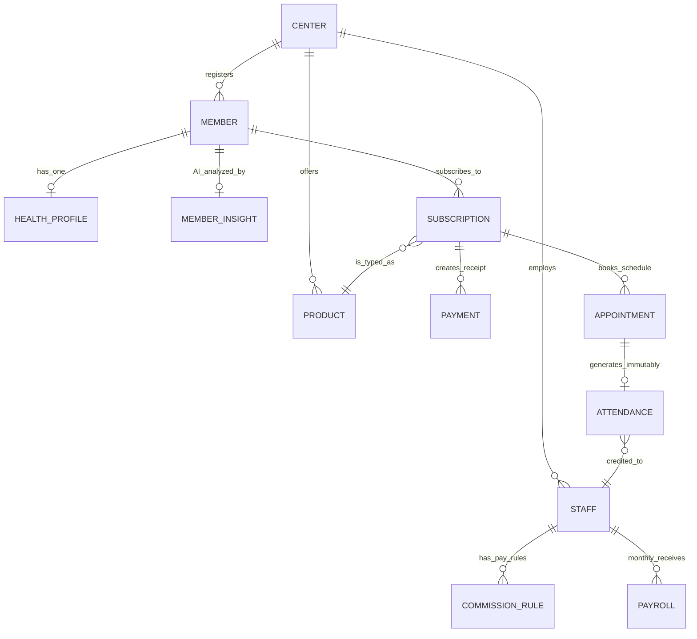

# AwareFit CRM (Backend Engine)

## 1. 프로젝트 개요 (Project Overview)
AwareFit CRM은 피트니스 센터, 필라테스, 요가 스튜디오 등 다중 회원 기반 비즈니스를 위한 최신형 엔터프라이즈 회원 관리 시스템의 백엔드 레포지토리입니다. 도메인 중심 설계(DDD)를 바탕으로 안전한 결제 및 구독 권한 관리 기능을 제공하며, `node-cron` 등을 활용한 AI 리텐션(유지율) 자동 추적 기능과 프리랜서/정직원의 세금 공제율이 반영되는 복잡한 급여 정산 엔진까지 모두 포함된 고성능 인프라입니다.

---

## 2. 기술 스택 (Tech Stack)

| Category | Technology | Description |
| :-- | :-- | :-- |
| **Runtime** | `Node.js` (v20+) | 기반 백엔드 런타임 |
| **Language** | `TypeScript` (v5+) | 정적 타입 시스템 명시 및 에러 방지 |
| **Framework** | `Fastify` (v4) | 극대화된 속도의 HTTP API 웹 프레임워크 |
| **ORM** | `Prisma` (v5) | 타입 안정성이 보장된 데이터베이스 관리 시스템 |
| **Database** | `SQLite` | 로컬 가상화 및 가벼운 상태 저장을 위한 기본 DB |
| **Validation** | `Zod` (v4) | 요청 Payload 및 환경변수의 검증 로직 구현 |
| **Testing** | `Vitest` & `Supertest` | 통합 테스트(Integration Testing) 환경 |
| **Scheduling**| `node-cron` | 새벽 통계 및 데이터 배치를 처리하는 스케줄러 |

---

## 3. 퀵 스타트 (Quick Start)

로컬 환경에서 빠르고 안전하게 서버를 기동하기 위한 절차입니다.

```bash
# 1. 레포지토리 클론
git clone <repository-url>
cd awarefit_crm

# 2. 환경 변수 설정
cp .env.example .env

# 3. 의존성 패키지 설치
npm install

# 4. 데이터베이스 마이그레이션 적용
npm run migrate

# 5. 초기 시드(Seed) 데이터베이스 주입 (기본 센터 및 스태프 생성)
npm run seed

# 6. 개발 서버 실행
npm run dev
```

서버가 실행되면 `http://localhost:3000/docs` 로 접속하여 자동 생성된 API Swagger 문서를 확인할 수 있습니다.

---

## 4. 디렉터리 구조 (Directory Structure)

```text
awarefit_crm/
├── prisma/             # Schema.prisma 모델 정의 및 DB 마이그레이션 파일/시드
├── src/                # 메인 애플리케이션 소스 코드
│   ├── jobs/           # Node-cron 기반 백그라운드 자동화 배치 스크립트 (Insight 등)
│   ├── lib/            # 글로벌 유틸리티 (로거 생성, DB 커넥터 인스턴스, 커스텀 에러 등)
│   ├── modules/        # 도메인 기반 모듈 (각 모듈별 router, service, schema 구조 강제)
│   ├── app.ts          # Fastify 미들웨어(Helmet, Cors 등) 및 글로벌 라우터 맵핑
│   └── server.ts       # 애플리케이션 진입점 및 Graceful Shutdown 훅 구성
├── tests/              # E2E 통합 테스트 및 DB 셋업 스크립트
├── .agents/            # Antigravity 시스템을 규정하는 규칙과 자동화 AI 스크립트 폴더
└── vitest.config.ts    # Vitest 통합 테스트 환경 변수 주입 경로
```

---

## 5. 전체 API 참고 문서 (API Reference)

| Method | Path | Description |
| :-- | :-- | :-- |
| `GET` | `/health` | 서버 헬스체크 및 Uptime, 타임스탬프 반환 |
| `GET/POST` | `/api/v1/members` | 전체 회원 조회 및 신규 회원 생성 (생성 시 HealthProfile/Insight 자동 포함) |
| `GET/POST` | `/api/v1/subscriptions` | 새로운 구독(멤버십/권수) 신청 및 결제 정보 처리 |
| `POST` | `/api/v1/subscriptions/:id/transfer`| 타 회원에게 멤버십 항목 양도 (`TRANSFER` 상태 변경 및 로그 저장) |
| `POST` | `/api/v1/appointments` | 스케줄 겹침 여부를 확인하여 예약 객체 생성 |
| `PATCH` | `/api/v1/appointments/:id/complete`| 스케줄을 처리하고 출석 차감, Attendance 기록 및 커미션 부여 트랜잭션 |
| `PATCH` | `/api/v1/appointments/:id/cancel` | `SCHEDULED` 예약을 사유(Reason)와 함께 `CANCELLED` 처리 |
| `PATCH` | `/api/v1/appointments/:id/noshow` | `SCHEDULED` 예약을 `NOSHOW`로 처리 |
| `POST` | `/api/v1/interactions` | 회원의 감정(Sentiment) 등 상담/대화 로그 작성 |
| `POST` | `/api/v1/workouts` | Workout Set가 중첩된 Workout 단위 트레이닝 기록 저장 |
| `PATCH` | `/api/v1/goals/:id/achieve` | 특정 진행 중인 목표 객체를 `ACHIEVED` 상태로 변환 |
| `POST` | `/api/v1/payrolls/calculate` | `targetMonth`를 기반으로 강사의 4대 보험/세금을 공제하여 급여 정산 |
| `GET` | `/api/v1/notifications/member/:id/pending` | 해당 회원이 읽지 않은 알람/푸시 내역 반환 |
| `PATCH` | `/api/v1/notifications/:id/read` | 알람 내역에 대한 읽음(Read) 상태 체크 |

---

## 6. 비즈니스 룰 문서 (Business Rules Documentation)

본 시스템은 다음 규칙들을 백엔드 레벨에서 절대적으로 준수합니다:

### 1) Attendance Immutability (출석 불변성)
- `Attendance` (출석) 레코드는 한 번 생성되면 **절대 UPDATE, DELETE** 될 수 없는 불변의 기록입니다.
- 오기입이 발생했다면 업데이트가 아닌 '수정 사유가 포함된 새로운 보정본(Correction Note)'을 발행하거나 예약을 복구하는 방식을 따라야 합니다.

### 2) 무제한 권수 처리 로직 (remainingCnt = -1)
- 정기권이나 기간제 무제한 멤버십의 경우 `remainingCnt` 값을 의도적으로 `-1` 로 할당하여 관리합니다.
- 차감 및 만료 수학 계산식에서는 `remainingCnt === -1` 일 때 값을 감소시키지 않도록 설계되었습니다.

### 3) Transaction Boundaries (원자적 트랜잭션 경계)
데이터 정합성을 보호하기 위해 다중 분기 로직은 반드시 `prisma.$transaction([])` 블록 하나로 처리되어 어느 한 곳에서 에러 발생 시 부분 저장이 롤백됩니다. 다음 로직들이 이에 해당합니다:
- **`Member` 생성:** 신규 `Member` + 기본 빈 객체인 `HealthProfile` + `MemberInsight` 결합 (전체 성공 시에만 Insert).
- **`Subscription` 생성:** `Subscription` 상태 Insert + 결제 영수 기록인 `Payment` Insert 맵핑.
- **`Subscription` 양도:** 기존 `Subscription` 상태 `TRANSFERRED` 변경 + 타인 명의의 새로운 `Subscription` 객체 파생 + `TransferLog`를 통한 원본 비교 추적 선 기록.
- **`Appointment` 완료 (5-Step):** 예약 상태 `COMPLETED` 수정 → `Attendance` 생성 및 커미션 변수 부여 → 멤버십 `remainingCnt -= 1` 적용 → (0 이하일 시 멤버십 상태 변경) (총 5단계).
- **`Payroll` 정산:** 이달의 세금과 페이롤 `Payroll.upsert` 적용 분기 + 계산된 퇴직 당월 발생액(`severanceAccrual`)을 가산하는 `SeveranceLedger.upsert` 연결 작동.

### 4) 급여 대상 월 검증 (targetMonth Format Enforcement)
- 월별 매출 및 급여 정산의 기준이 되는 모든 `targetMonth` 값은 Zod 스키마 레벨과 라우터에서 정규식 `/^\d{4}-(0[1-9]|1[0-2])$/` (`YYYY-MM`) 규칙을 강제적으로 따르도록 설계되었습니다. 에러 발생 시 HTTP `400 Bad Request` 에러를 표출합니다.

---

## 7. 환경 변수 참조 (Environment Variables)

`.env.example` 파일을 복사하여 사용하는 환경 변수 테이블입니다.

| Key | Example Value | Description |
| :-- | :-- | :-- |
| `DATABASE_URL` | `file:./dev.db` | Prisma가 SQLite 데이터베이스를 매핑하거나 외부 연결 시 참조할 원본 디렉토리/링크 지정 |
| `PORT` | `3000` | Fastify 서버가 Listen 하는 포트 |
| `NODE_ENV` | `development` | 서버 개발/운영/스테이징 구분을 위한 시스템 런타임 표시자 |
| `CORS_ORIGIN` | `*` 또는 `http://localhost:3000` | 로컬 애플리케이션이나 Vercel 등 외부 프론트엔드 연결 시 크로스 도메인 보안을 위한 오리진 경로 제한 |

---

## 8. 데이터베이스 ERD 구조 다이어그램 (DB Schema Diagram)

핵심 비즈니스 모델 간의 관계를 단순화한 텍스트 기반 개체-관계 구조입니다.



* **Center (학원/센터)** 에 종속된 멤버(회원), 스태프(직원), 프로덕트(회원권)가 큰 축을 이룹니다.
* **Subscription (현재 보유 멤버십)** 에서 파생되어 **Appointment (예약)** 이 발생하며 성공 시 불변의 **Attendance (출석 및 영수 증빙)** 가 생성됩니다.
* **Attendance** 정보와 **Product** 모델의 기간 및 데이터를 취합하여, AI **MemberInsight** 스케줄러가 이탈 확률을 주기적 계산합니다.
